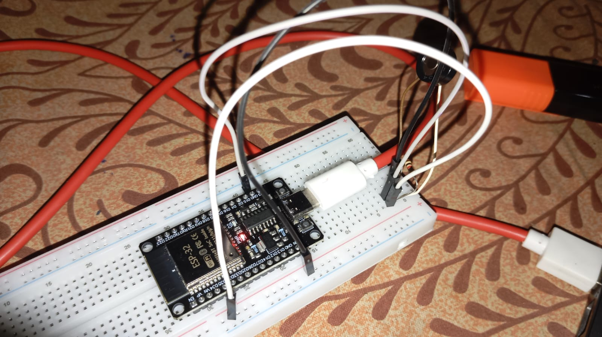
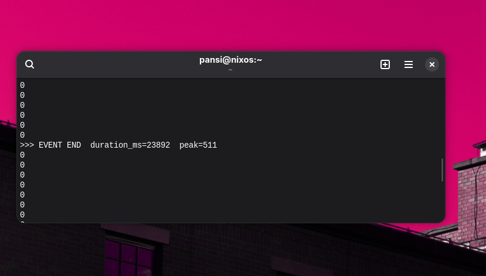
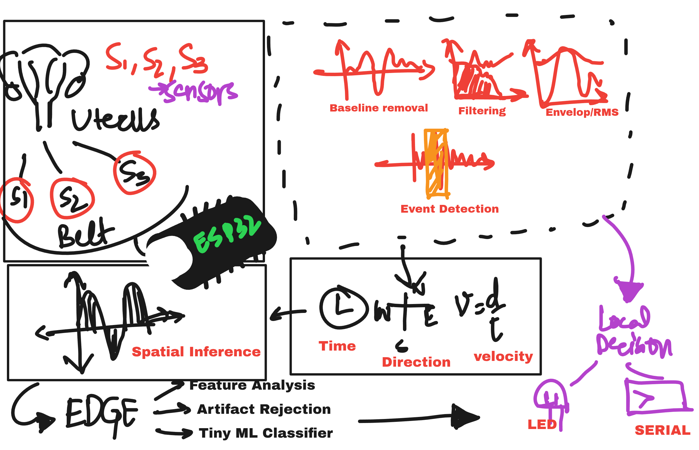

# SELENE





> This prototype demonstrates SELENE's fundamental sensing principle: spatially separated sensors can turn time differences into information about an event. A controlled mechanical impulse is detected at multiple sensing points, while the ESP32 measures their relative arrival times and reconstructs the event's propagation direction and velocity entirely on-device. The demonstration therefore validates the core pipeline behind SELENE not simply detecting an event, but using its spatiotemporal signature to localize it at the edge.

--- 

>**The body doesn't wait for the next appointment.**

SELENE is a low-cost, Edge-AI wearable research platform exploring how **spatiotemporal information** can improve continuous physiological monitoring.
Instead of treating a physiological event as a single waveform, SELENE uses a distributed sensor array to ask:
**Where did the event occur? How did it propagate? How fast did it move? Is the observed pattern meaningful or an artifact?**
The inference pipeline is designed to run locally on an **ESP32**, enabling low-latency, offline-first physiological intelligence without requiring raw signals to be continuously transmitted to the cloud.


## The Research Insight

A physiological event is more than a change in amplitude.
Its **timing across physical space** can reveal how activity propagates information that a single sensor cannot capture.
> **The delay is not noise. It is information.**
Research in multichannel electrohysterography has demonstrated measurable spatial propagation of uterine electrical activity, motivating SELENE's approach to distributed sensing and spatiotemporal inference.


## Why SELENE?
Clinical monitoring often provides **intermittent snapshots** of a physiological system that is changing continuously.
SELENE explores an accessible monitoring layer that can operate **between clinical assessments**, rather than attempting to replace them.
The core idea is to transform:
**Intermittent observation → Continuous physiological insight**

while keeping signal processing and inference local to the device.


# Architecture



### No cloud in the inference loop.

Raw signals can remain at the point of measurement while processing and decision-making happen directly on the embedded device. 
(This is with regards to the competition guidelines of implementing EDGE AI Technology) 


# How It Works

### 01 : Sense

Multiple spatially separated sensors capture the same physiological event from different locations.

### 02 : Synchronize

The ESP32 samples the channels and maintains their temporal relationship.

### 03 : Process

Signals undergo baseline correction, filtering, envelope/RMS extraction, and event segmentation.

### 04 : Correlate

Cross-correlation estimates the relative arrival time of an event between sensor pairs.

### 05 : Localize

Known sensor spacing and measured time delays are used to estimate propagation direction and velocity.

`v = d / Δt`

### 06 : Infer

Spatial, temporal, and morphological features can be passed to a lightweight Edge-AI model for local classification and artifact rejection.


# Prototype

The first SELENE prototype focuses on demonstrating the **spatiotemporal inference principle** using accessible embedded hardware.

### Hardware

- ESP32 development board
- Multi-channel sensor array
- Analog signal-conditioning components
- LEDs
- Buzzer
- Breadboard prototype
- Custom PCB planned for the next iteration (This is under the developmental stages)

### Software

- C/C++
- Arduino-ESP32
- Embedded DSP
- Cross-correlation
- Feature extraction
- TinyML
- Serial visualization


# Demonstration

SELENE is to be demonstrated using controlled propagation experiments.

### Forward propagation

```text
S1 → S2 → S3
```

The system should observe progressively delayed signals and estimate the corresponding direction.

### Reverse propagation

```text
S3 → S2 → S1
```

The estimated direction should reverse.

### Simultaneous disturbance

```text
S1 ≈ S2 ≈ S3
```

A simultaneous response across the array can be treated as a potential artifact rather than a propagating event.

This makes the demonstration more than:

> "Sensor detects movement."

It demonstrates:

> **Sense → correlate → localize → decide.**

# Edge AI Strategy

SELENE deliberately separates **signal understanding** from **machine learning**.

The initial system establishes an interpretable DSP baseline:

```text
RAW SIGNAL
    ↓
FILTER
    ↓
EVENT
    ↓
TIME DELAY
    ↓
PROPAGATION FEATURES
    ↓
LOCAL DECISION
```

Once sufficient data is collected, lightweight ML can be introduced:

```text
Temporal features
       +
Morphological features
       +
Spatial features
       +
Synchrony
       ↓
   TinyML model
       ↓
Physiological pattern
       /
Potential artifact
```

This keeps the system explainable while allowing progressively more sophisticated Edge AI.

# Roadmap

```text
                    SELENE
                       │
        ┌──────────────┼──────────────┐
        ▼              ▼              ▼
      TODAY           NEXT          FUTURE
        │              │              │
   3-channel       4+ channel      Clinical
   prototype       spatial array    validation
        │              │              │
   ESP32 DSP        2D mapping     Real EHG data
        │              │              │
   Localization     Custom PCB     Personalized AI
        │              │              │
   Phantom demo     Wearable       Longitudinal
                    platform       monitoring
```

### Today

**Sense → correlate → localize → decide on an ESP32.**

### Next

**Expand from three sensing points to a wearable 2D spatial array with a dedicated PCB and stronger artifact rejection.**

### Future

**Develop personalized Edge-AI models and validate the spatiotemporal architecture against established physiological measurement systems.**


# Impact

### Continuous Insight

SELENE explores a shift from intermittent physiological snapshots toward continuous characterization between clinical assessments.

### Spatial Intelligence

Instead of asking only whether an event occurred, SELENE investigates where it originated and how it propagated.

### Accessible Hardware

The architecture is intentionally prototyped using low-cost embedded components before progressing toward specialized wearable hardware.

### Privacy by Design

Local processing reduces the need to continuously transmit sensitive physiological signals to external infrastructure.


# Future Scope

### 2D Physiological Mapping

Increasing sensor count and improving geometry could enable estimation of two-dimensional propagation vectors and spatial activity maps.

### Flexible Wearable PCB

A custom flexible PCB could integrate sensing, analog front-end circuitry, the MCU, power management, and local feedback into a compact wearable platform.

### Personalized Edge AI (As advised for the course of competition)

Instead of relying exclusively on population-level thresholds, SELENE could learn an individual's baseline physiological signature and detect meaningful deviations locally.

### Longitudinal Monitoring

Repeated measurements could enable research into how an individual's spatiotemporal physiological patterns change over time.

### Broader Applications

The underlying architecture is a general **spatiotemporal sensing framework** and could potentially be adapted to other physiological signals where spatial propagation contains meaningful information.


# Limitations

SELENE is currently an **engineering and research prototype**, not a clinical diagnostic device yet as the research is under formulation.

The prototype's sensing hardware and controlled experiments should not be interpreted as equivalent to clinically validated electrohysterography instrumentation.

Clinical translation would require:

- Human-subject studies
- Large and diverse datasets
- Validation against established instrumentation
- Robust motion-artifact characterization
- Clinical evaluation
- Safety and regulatory assessment

SELENE does **not** diagnose uterine fibroids, endometriosis, preterm labor, miscarriage, or other pregnancy complications.

Its present objective is to demonstrate the feasibility of **low-cost, spatially distributed physiological sensing and Edge-AI inference**.


# Research Foundation

1. **Mikkelsen et al. (2013)**  
   *Electrohysterography of labor contractions: propagation velocity and direction.*  
   Acta Obstetricia et Gynecologica Scandinavica.  
   DOI: `10.1111/aogs.12190`

2. **Lange et al. (2014)**  
   *Velocity and Directionality of the Electrohysterographic Signal Propagation.*  
   PLOS ONE, 9(1), e86775.  
   DOI: `10.1371/journal.pone.0086775`

3. **Kuijsters et al. (2020)**  
   *Propagation of spontaneous electrical activity in the ex vivo human uterus.*  
   Pflügers Archiv – European Journal of Physiology, 472, 1065–1078.  
   DOI: `10.1007/s00424-020-02426-w`

4. **Barnova et al. (2026)**  
   *Electrohysterography in modern obstetrics: Advances in signal processing, machine learning, and clinical applications.*  
   Artificial Intelligence in Medicine, 171, 103303.  
   DOI: `10.1016/j.artmed.2025.103303`

5. **Acquaviva et al. (2026)**  
   *Automatic detection of uterine contractions before and during labor using EHG: A systematic review.*  
   Computer Methods and Programs in Biomedicine, 284, 109460.  
   DOI: `10.1016/j.cmpb.2026.109460`

6. **Li et al. (2024)**  
   *The influence of uterine fibroids on adverse outcomes in pregnant women: a meta-analysis.*  
   BMC Pregnancy and Childbirth, 24, 345.  
   DOI: `10.1186/s12884-024-06545-5`

# Project Status

**Prototype / Research**

```text
[✓] System concept
[✓] Spatiotemporal architecture
[✓] Edge-first design
[✓] Research foundation
[ ] Multi-channel acquisition
[ ] Real-time correlation
[ ] Propagation localization
[ ] Artifact rejection
[ ] Edge classifier
[ ] Custom PCB
[ ] Clinical validation
```
## Core Idea

> **A physiological event is more than a spike.**  
> **Its timing across space can become information.**

### SELENE

A research inititative by [Nishtha](https://github.com/nishtha-22) and [Priyanshi](https://github.com/kirbx01).

---

> **Disclaimer:** SELENE is an experimental research prototype and is not intended for diagnosis, treatment, or medical decision-making as of now.
